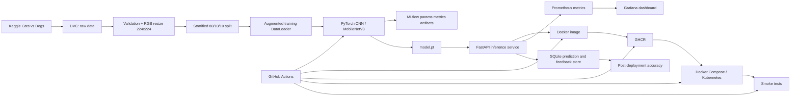

# Cats vs Dogs - End-to-End MLOps Pipeline

**Course:** AIMLCZG523 - MLOps, Assignment 2  
**Use case:** Binary image classification for a pet-adoption platform  
**Input standard:** 224 x 224 RGB  
**Default split:** 80% train / 10% validation / 10% test  
**Primary stack:** Git, DVC, PyTorch, MLflow, FastAPI, Docker, GitHub Actions, Docker Compose/Kubernetes, Prometheus, Grafana

## 1. What is included

This repository is a complete academic submission package covering all five marking modules:

| Module | Implemented evidence |
|---|---|
| M1 - Development and tracking | Git-ready structure, DVC pipeline, Kaggle downloader, validation/resizing/splitting, augmentation, TinyCNN baseline, optional MobileNetV3 transfer learning, MLflow parameters/metrics/artifacts, serialized `.pt` model, loss curves and confusion matrix |
| M2 - Packaging and containerization | FastAPI service, `/health`, `/predict`, `/model-info`, pinned dependencies, non-root Docker image, local curl/Postman support |
| M3 - CI | Pytest unit/API tests, Ruff, GitHub Actions checkout/install/test/build, GHCR publishing, test and deployment evidence artifacts, SBOM and provenance |
| M4 - CD and deployment | Docker Compose, Kubernetes Deployment/Service/HPA, main-branch image pull and deployment, optional persistent VM deployment, health and prediction smoke test that fails the pipeline |
| M5 - Monitoring and final package | JSON request logs, Prometheus counters/histograms, Grafana dashboard, SQLite prediction metadata, delayed true-label feedback, post-deployment accuracy endpoint and batch script |

The ZIP includes a small deterministic demo dataset and a working bootstrap model so the API, container, tests, monitoring, and smoke tests can start without Kaggle credentials. For final academic metrics, run the same pipeline on the Kaggle dataset using the command in Section 4.

## 2. Architecture



## 3. Prerequisites

- Python 3.11
- Git
- Docker Desktop with Docker Compose v2
- Kaggle account and API token for the full dataset
- Optional: DVC remote storage, GitHub account/GHCR, Kubernetes cluster

Windows PowerShell should allow local scripts for the current process:

```powershell
Set-ExecutionPolicy -Scope Process -ExecutionPolicy Bypass
```

## 4. One-command setup and full dataset

### A. Validate immediately with the bundled demo data

**Windows PowerShell**

```powershell
cd Cats_Dogs_MLOps_Assignment2
.\scripts\bootstrap.ps1
```

**Linux/macOS**

```bash
cd Cats_Dogs_MLOps_Assignment2
./scripts/bootstrap.sh
```

This creates a virtual environment, installs dependencies, prepares the 224 x 224 data, trains/evaluates, and runs tests.

### B. Replace demo data with the Kaggle Dogs vs Cats dataset

1. Download `kaggle.json` from Kaggle Account Settings.
2. Place it in `%USERPROFILE%\.kaggle\kaggle.json` on Windows or `~/.kaggle/kaggle.json` on Linux/macOS.
3. Accept the competition rules for `dogs-vs-cats` on Kaggle.
4. Run:

```powershell
& .\.venv\Scripts\Activate.ps1
Remove-Item -Recurse -Force data\raw\* -ErrorAction SilentlyContinue
python -m cats_dogs_mlops.download_data --mode competition --slug dogs-vs-cats --destination data/raw --force
python -m cats_dogs_mlops.prepare_data --raw-dir data/raw --processed-dir data/processed --image-size 224 --train-ratio 0.8 --val-ratio 0.1 --seed 42
```

When Kaggle produces nested `train.zip`, extract it into `data/raw` before preparation:

```powershell
Expand-Archive data\raw\train.zip -DestinationPath data\raw\train -Force
```

Initialize DVC once and version the data:

```powershell
git init
dvc init
dvc add data/raw
git add .
git commit -m "chore: version source and Kaggle dataset"
```

Run the complete reproducible pipeline:

```powershell
dvc repro
```

The DVC stages are `prepare`, `train`, and `evaluate`. Re-running `dvc repro` only executes stages whose dependencies, parameters, or data changed.

## 5. Strong model option

The required baseline is TinyCNN. For higher real-data accuracy, train a transfer-learning model:

```powershell
python -m cats_dogs_mlops.train `
  --manifest data/processed/manifest.csv `
  --model-out models/model.pt `
  --metrics-out reports/train_metrics.json `
  --figures-dir figures `
  --architecture mobilenet_v3_small `
  --pretrained `
  --freeze-backbone `
  --epochs 8 `
  --batch-size 32 `
  --learning-rate 0.001 `
  --image-size 224
python -m cats_dogs_mlops.evaluate
```

For fine-tuning, repeat training without `--freeze-backbone` using a smaller learning rate such as `0.0001`.

## 6. MLflow experiment tracking

Start the tracking server in Terminal 1:

```powershell
& .\.venv\Scripts\Activate.ps1
mlflow server --host 0.0.0.0 --port 5000 --backend-store-uri sqlite:///mlflow.db --default-artifact-root ./mlartifacts
```

In Terminal 2:

```powershell
$env:MLFLOW_TRACKING_URI="http://localhost:5000"
python -m cats_dogs_mlops.train --manifest data/processed/manifest.csv --epochs 5
```

Open `http://localhost:5000`. The run logs:

- Architecture, seed, image size, batch size, learning rate, weight decay, sample counts, and device
- Train loss, validation loss, validation accuracy, macro precision/recall/F1, and training duration
- `model.pt`, `train_metrics.json`, classification report, loss curves, and confusion matrix

## 7. Run and test the API locally

```powershell
& .\.venv\Scripts\Activate.ps1
$env:MODEL_PATH="models/model.pt"
uvicorn cats_dogs_mlops.api:app --host 0.0.0.0 --port 8000 --reload
```

Open Swagger UI: `http://localhost:8000/docs`

Health check:

```powershell
Invoke-RestMethod http://localhost:8000/health
```

Prediction:

```powershell
curl.exe -X POST http://localhost:8000/predict -F "file=@tests/assets/cat_demo.png"
```

The response contains `request_id`, label, confidence, per-class probabilities, latency, and model version.

Feedback and online performance:

```powershell
$prediction = curl.exe -s -X POST http://localhost:8000/predict -F "file=@tests/assets/cat_demo.png" | ConvertFrom-Json
Invoke-RestMethod -Method Post -Uri http://localhost:8000/feedback -ContentType "application/json" -Body (@{request_id=$prediction.request_id; true_label="cat"} | ConvertTo-Json)
Invoke-RestMethod http://localhost:8000/monitoring/performance
```

## 8. Automated tests

```powershell
pytest -q
ruff check src tests
```

Tests cover:

- Image conversion, resizing, normalization, and RGB shape
- Inference probability distribution and label utility
- Prediction feedback and post-deployment accuracy calculation
- FastAPI health and prediction endpoints

## 9. Docker and complete observability stack

Build only the API:

```powershell
docker build -t cats-dogs-mlops:local .
docker run --rm -p 8000:8000 cats-dogs-mlops:local
```

Start API + MLflow + Prometheus + Grafana:

```powershell
docker compose -f deployment/docker-compose.yml up -d --build
```

Services:

| Service | URL | Credentials |
|---|---|---|
| FastAPI | `http://localhost:8000/docs` | none |
| MLflow | `http://localhost:5000` | none for local use |
| Prometheus | `http://localhost:9090` | none |
| Grafana | `http://localhost:3000` | `admin` / `admin` - change outside local use |

Run the mandatory post-deploy test:

```powershell
python -m cats_dogs_mlops.smoke_test --base-url http://localhost:8000 --image tests/assets/cat_demo.png
```

Collect simulated labeled production requests:

```powershell
python -m cats_dogs_mlops.post_deploy_batch --base-url http://localhost:8000 --manifest data/processed/manifest.csv --limit 20
```

Stop all services:

```powershell
docker compose -f deployment/docker-compose.yml down -v
```

## 10. CI/CD configuration

`.github/workflows/ci-cd.yml` performs:

1. Checkout on push and pull request
2. Python 3.11 setup and dependency cache
3. Ruff static analysis
4. Pytest unit/API tests and JUnit evidence upload
5. Docker Buildx build
6. Image push to GitHub Container Registry for non-PR events
7. SBOM and provenance generation
8. Main-branch deployment using the newly published image
9. Health and prediction smoke tests
10. Deployment log evidence upload
11. Optional persistent VM deployment when repository variable `ENABLE_REMOTE_DEPLOY=true`

For optional remote deployment, configure these GitHub secrets:

- `DEPLOY_HOST`
- `DEPLOY_USER`
- `DEPLOY_SSH_KEY`
- `DEPLOY_PATH`
- `GHCR_TOKEN`

The target VM must contain this repository, Docker, Docker Compose, and Python.

## 11. Kubernetes deployment

Edit the image in `deployment/k8s/deployment.yaml`, then run:

```bash
kubectl apply -f deployment/k8s/deployment.yaml
kubectl apply -f deployment/k8s/hpa.yaml
kubectl rollout status deployment/cats-dogs-api
kubectl port-forward service/cats-dogs-api 8000:80
python -m cats_dogs_mlops.smoke_test --base-url http://localhost:8000 --image tests/assets/cat_demo.png
```

The manifest includes two replicas, rolling updates, resource requests/limits, readiness/liveness probes, Prometheus annotations, and an HPA.

## 12. Monitoring design

The service exposes `/metrics` with:

- `cats_dogs_requests_total{method,endpoint,status}`
- `cats_dogs_request_latency_seconds{endpoint}` histogram
- `cats_dogs_predictions_total{label}`

Application logs are structured JSON and exclude uploaded image bytes and filenames from prediction records. The SQLite monitoring store keeps request ID, timestamp, predicted label, confidence, probability JSON, latency, and optional true label. This supports delayed ground truth and post-deployment accuracy through `/monitoring/performance`.

## 13. Submission procedure

1. Run the Kaggle workflow and `dvc repro`.
2. Capture screenshots of MLflow metrics/artifacts, GitHub Actions success, Docker/Compose status, prediction response, Grafana panels, and post-deployment performance.
3. Run `pytest -q` and save the output.
4. Follow `scripts/demo_recording_script.md` to record a video under five minutes.
5. Replace the bootstrap metrics/screenshots in the report with Kaggle-run evidence where required.
6. Create the submission ZIP:

```powershell
Compress-Archive -Path * -DestinationPath ..\Cats_Dogs_MLOps_Assignment2_Submission.zip -Force
```

Do not include `.venv`, Docker volumes, Kaggle credentials, or unnecessary raw data if the LMS file-size limit is low. Include the trained `models/model.pt`, DVC configuration, `dvc.lock`, metrics, figures, report, and all source/configuration files.

## 14. Important evidence note

The supplied `models/model.pt` and figures prove that the packaged API and pipeline are executable offline. Their metrics use the bundled deterministic demo images and are not claimed as Kaggle generalization results. The code path, preprocessing, model, tracking, CI/CD, monitoring, and deployment remain the same; execute Section 4 on the Kaggle dataset to generate the final academic results.
